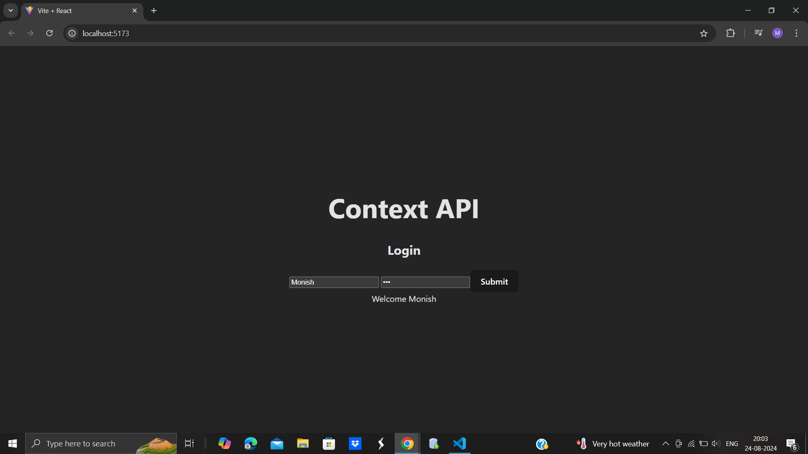

# React + Vite

This template provides a minimal setup to get React working in Vite with HMR and some ESLint rules.

Currently, two official plugins are available:

- [@vitejs/plugin-react](https://github.com/vitejs/vite-plugin-react/blob/main/packages/plugin-react/README.md) uses [Babel](https://babeljs.io/) for Fast Refresh
- [@vitejs/plugin-react-swc](https://github.com/vitejs/vite-plugin-react-swc) uses [SWC](https://swc.rs/) for Fast Refresh

# React: Context API

Create a context using createContext() method of React. Save it with .js extension

```javascript
import React from "react";

const UserContext = React.createContext();

export default UserContext;
```

Create the UserContextProvider.jsx which is to be used to provide the access of userContext to various other components.

```javascript
import { useState } from 'react';
import UserContext from './UserContext'

const UserContextProvider = ({children}) =>{
    const [user, setUser] = useState(null);
    return (
        <UserContext.Provider value={{user,setUser}}>
        {children}
        </UserContext.Provider>
    )
}

export default UserContextProvider;
```

Create the components and access the data provided by useContext as follows:-

```javascript
const {setUser} = useContext();
```

Login.jsx Component:-

```javascript
import React,{useSate, useContext, useState} from 'react'
import UserContext from '../context/UserContext'

function Login() {
    const [username,setUsername] = useState('');
    const [password, setPassword] = useState('');
    const {setUser} = useContext(UserContext);
    const handleSubmit = (e) =>{
        e.preventDefault();
        setUser({username, password});
    }
  return (
    <div>
        <h2>Login</h2>
        <input type="text" placeholder='username' value={username} onChange={(e) => setUsername(e.target.value)}/>
        <input type="password" placeholder='password' value={password} onChange={(e) => setPassword(e.target.value)}/>
        <button onClick={handleSubmit} >Submit</button>
    </div>
  )
}

export default Login
```

Read the data set by the Login.jsx in Profile.jsx as follows:-

```javascript
import React,{useContext} from 'react'
import UserContext from '../context/UserContext'
function Profile() {
    const {user} = useContext(UserContext);

    if(!user) return <div>Please Login</div>
    return <div>Welcome {user.username}</div>
}

export default Profile
```

Now simply use the  above components in the App.jsx
```javascript
import Login from "./components/Login"
import Profile from "./components/Profile"
import UserContextProvider from "./context/UserContextProvider"
import './App.css'

function App() {

  return (
    <>
      <UserContextProvider>
        <h1>Context API</h1>
        <Login />
        <Profile />
      </UserContextProvider>
    </>
  )
}

export default App

```
Output After the above
